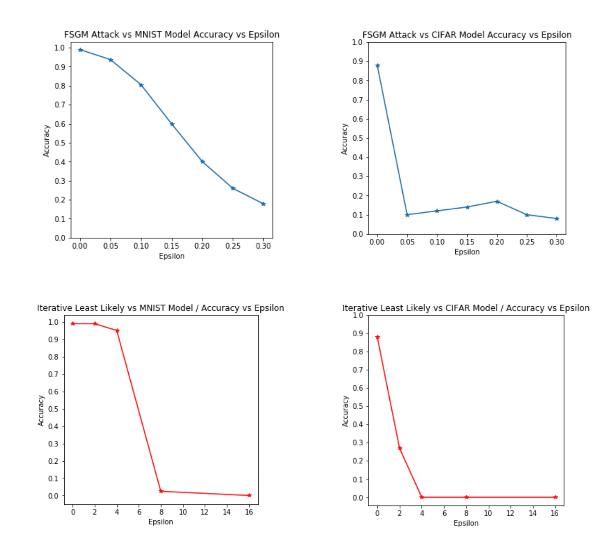
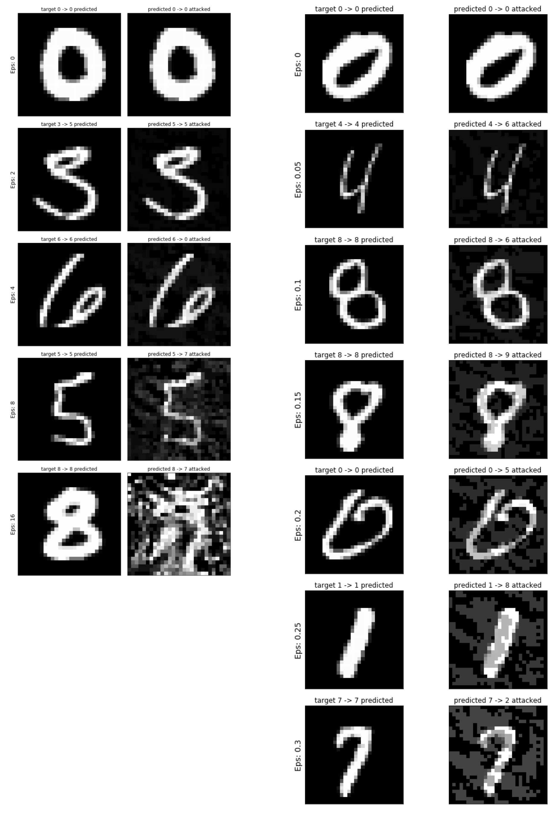
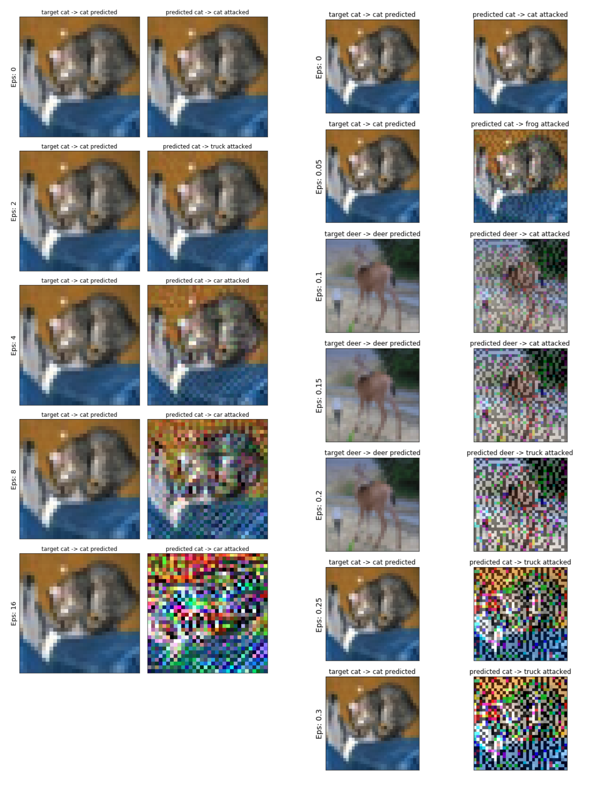

# Adversarial Attacks Example in Pytorch

This repository contains a sample PyTorch implementation of adversarial attacks.

It contains two types of adversarial attack methods:

* Fast Sign Gradient Method
* Iterative Least Likely Method

It trains and then attacks two different neural net models:

* a LeNet model trained on the MNIST dataset (98%+ accuracy)
* a DenseNet model trained on the CIFAR10 dataset (appx. 90% accuracy)

## Plots



## LeNet MNist Attack Examples



## DenseNet CIFAR Attack Examples



## Requirements

```
pip install torch
pip install torchvision
```

## Code

See the included Jupyter Notebook (`aa.ipynb`) for the implementation.

## References

[1]  Ian Goodfellow, Jonathon Shlens, and Christian Szegedy. Explaining and harnessing adversarial examples. In International Conference on Learning Representations, 2015.

[2]  Kaiming He, Xiangyu Zhang, Shaoqing Ren, and Jian Sun. Deep residual learning for image recognition. CoRR, abs/1512.03385, 2015.

[3]  Gao Huang, Zhuang Liu, Laurens van der Maaten, and Kilian Q. Weinberger. Densely connected convolutional networks. 2017 IEEE Conference on Computer Vision and Pattern Recognition (CVPR), pages 2261–2269, 2017.

[4]  Alexey Kurakin, Ian J. Goodfellow, and Samy Bengio. Adversarial machine learning at scale.CoRR, abs/1611.01236, 2016.

[5]  Seyed-Mohsen Moosavi-Dezfooli, Alhussein Fawzi, and Pascal Frossard. Deepfool: A simple and accurate method to fool deep neural networks. In CVPR, pages 2574–2582. IEEE Computer Society, 2016.

[6]  Christian Szegedy, Wojciech Zaremba, Ilya Sutskever, Joan Bruna, Dumitru Erhan, Ian J. Goodfellow, and Rob Fergus. Intriguing properties of neural networks. CoRR, abs/1312.6199, 2013.

[7] Sergey Zagoruyko and Nikos Komodakis. Wide residual networks. CoRR, abs/1605.07146, 2016.

[8] [PyTorch FGSM Tutorial](https://pytorch.org/tutorials/beginner/fgsm_tutorial.html)


## Contributors

* Magnus Osberg
* Hengameh Zabihi
* Chowoo Jo
* Kasim Te

From June 2019 @ [KAIST](http://www.kaist.ac.kr).
